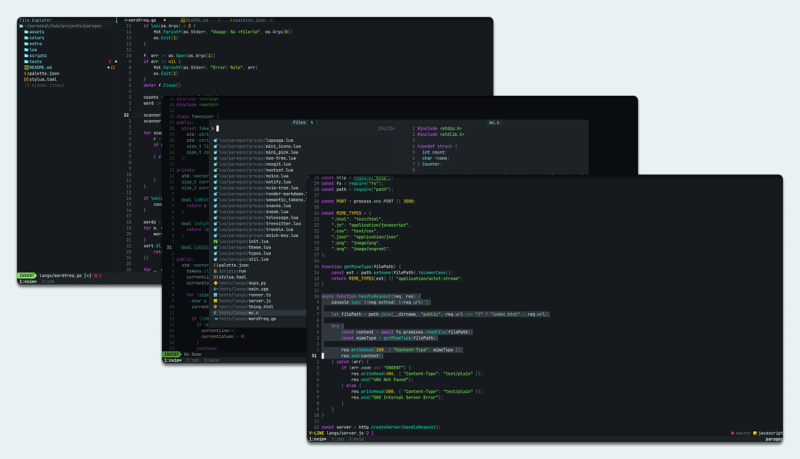
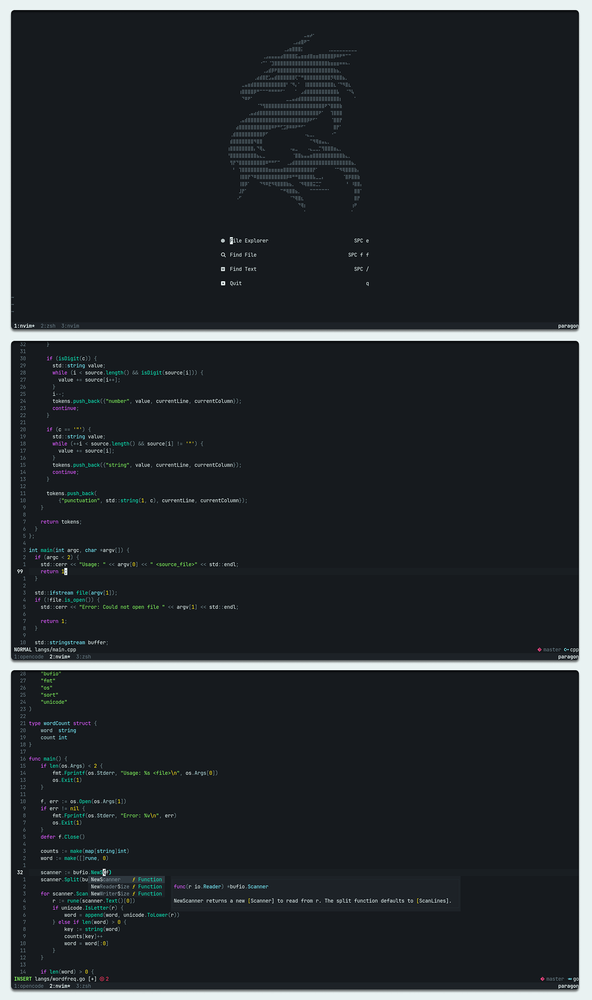

<h1 align="center">
	<br/>
	Paragon
</h1>
<p align="center">
  
</p>

<p align="center">
    A refined dark theme for Neovim, designed for semantic clarity and long, distraction-free coding sessions.
</p>

<details>
<summary>Preview</summary>

<p align="center">
  
</p>

</details>

## Features
- **30+ Cross-Tool Ports** – Terminals, editors, and CLI tools.
- **30+ Plugin Integrations** – Native support for major Neovim plugins.
- **Semantic & Balanced Design** – Purposeful highlights with refined contrast for long sessions.
- **Flexible Customization** – Transparency, dimming, borders, and syntax styling.

<details>
<summary>Ports</summary>

<!-- extras:start -->

| Tool | Extra |
| --- | --- |
| [Alacritty](https://github.com/alacritty/alacritty) | [extra/alacritty](extra/alacritty) |
| [bat](https://github.com/sharkdp/bat) | [extra/bat](extra/bat) |
| [btop](https://github.com/aristocratos/btop) | [extra/btop](extra/btop) |
| [delta](https://github.com/dandavison/delta) | [extra/delta](extra/delta) |
| [dunst](https://github.com/dunst-project/dunst) | [extra/dunst](extra/dunst) |
| [eza](https://eza.rocks) | [extra/eza](extra/eza) |
| [Fish](https://fishshell.com) | [extra/fish](extra/fish) |
| [Foot](https://codeberg.org/dnkl/foot) | [extra/foot](extra/foot) |
| [fzf](https://github.com/junegunn/fzf) | [extra/fzf](extra/fzf) |
| [Ghostty](https://github.com/ghostty-org/ghostty) | [extra/ghostty](extra/ghostty) |
| [GNOME Terminal](https://gitlab.gnome.org/GNOME/gnome-terminal) | [extra/gnome-terminal](extra/gnome-terminal) |
| [Helix](https://helix-editor.com) | [extra/helix](extra/helix) |
| [iTerm](https://iterm2.com) | [extra/iterm](extra/iterm) |
| [Kitty](https://sw.kovidgoyal.net/kitty) | [extra/kitty](extra/kitty) |
| [Konsole](https://konsole.kde.org) | [extra/konsole](extra/konsole) |
| [lazygit](https://github.com/jesseduffield/lazygit) | [extra/lazygit](extra/lazygit) |
| [Obsidian](https://obsidian.md) | [extra/obsidian](extra/obsidian) |
| [opencode](https://github.com/sst/opencode) | [extra/opencode](extra/opencode) |
| [rofi](https://github.com/davatorium/rofi) | [extra/rofi](extra/rofi) |
| [st](https://st.suckless.org) | [extra/st](extra/st) |
| [Starship](https://starship.rs) | [extra/starship](extra/starship) |
| [Terminator](https://gnome-terminator.readthedocs.io) | [extra/terminator](extra/terminator) |
| [Tmux](https://github.com/tmux/tmux) | [extra/tmux](extra/tmux) |
| [Vim](https://www.vim.org) | [extra/vim](extra/vim) |
| [VS Code](https://code.visualstudio.com) | [extra/vscode](extra/vscode) |
| [Warp](https://www.warp.dev) | [extra/warp](extra/warp) |
| [Waybar](https://github.com/Alexays/Waybar) | [extra/waybar](extra/waybar) |
| [WezTerm](https://wezfurlong.org/wezterm) | [extra/wezterm](extra/wezterm) |
| [Windows Terminal](https://aka.ms/terminal) | [extra/windows-terminal](extra/windows-terminal) |
| [XFCE Terminal](https://docs.xfce.org/apps/terminal) | [extra/xfce-terminal](extra/xfce-terminal) |
| [Yazi](https://yazi-rs.github.io) | [extra/yazi](extra/yazi) |
| [Zellij](https://zellij.dev) | [extra/zellij](extra/zellij) |

<!-- extras:end -->

</details>

<details>
<summary>Supported Plugins</summary>

<!-- plugins:start -->

| Plugin | Source |
| --- | --- |
| [aerial.nvim](https://github.com/stevearc/aerial.nvim) | [`aerial`](lua/paragon/groups/aerial.lua) |
| [barbar.nvim](https://github.com/romgrk/barbar.nvim) | [`barbar`](lua/paragon/groups/barbar.lua) |
| [blink.cmp](https://github.com/Saghen/blink.cmp) | [`blink`](lua/paragon/groups/blink.lua) |
| [bufferline.nvim](https://github.com/akinsho/bufferline.nvim) | [`bufferline`](lua/paragon/groups/bufferline.lua) |
| [nvim-cmp](https://github.com/hrsh7th/nvim-cmp) | [`cmp`](lua/paragon/groups/cmp.lua) |
| [diffview.nvim](https://github.com/sindrets/diffview.nvim) | [`diffview`](lua/paragon/groups/diffview.lua) |
| [dashboard-nvim](https://github.com/nvimdev/dashboard-nvim) | [`dashboard`](lua/paragon/groups/dashboard.lua) |
| [flash.nvim](https://github.com/folke/flash.nvim) | [`flash`](lua/paragon/groups/flash.lua) |
| [fzf-lua](https://github.com/ibhagwan/fzf-lua) | [`fzf`](lua/paragon/groups/fzf.lua) |
| [vim-gitgutter](https://github.com/airblade/vim-gitgutter) | [`gitgutter`](lua/paragon/groups/gitgutter.lua) |
| [gitsigns.nvim](https://github.com/lewis6991/gitsigns.nvim) | [`gitsigns`](lua/paragon/groups/gitsigns.lua) |
| [glyph-palette.vim](https://github.com/lambdalisue/glyph-palette.vim) | [`glyph-palette`](lua/paragon/groups/glyph-palette.lua) |
| [grug-far.nvim](https://github.com/MagicDuck/grug-far.nvim) | [`grug-far`](lua/paragon/groups/grug-far.lua) |
| [headlines.nvim](https://github.com/lukas-reineke/headlines.nvim) | [`headlines`](lua/paragon/groups/headlines.lua) |
| [hop.nvim](https://github.com/phaazon/hop.nvim) | [`hop`](lua/paragon/groups/hop.lua) |
| [indentmini.nvim](https://github.com/nvimdev/indentmini.nvim) | [`indentmini`](lua/paragon/groups/indentmini.lua) |
| [lazy.nvim](https://github.com/folke/lazy.nvim) | [`lazy`](lua/paragon/groups/lazy.lua) |
| [leap.nvim](https://github.com/ggandor/leap.nvim) | [`leap`](lua/paragon/groups/leap.lua) |
| [lspsaga.nvim](https://github.com/glepnir/lspsaga.nvim) | [`lspsaga`](lua/paragon/groups/lspsaga.lua) |
| [mini.icons](https://github.com/echasnovski/mini.icons) | [`mini_icons`](lua/paragon/groups/mini_icons.lua) |
| [mini.pick](https://github.com/echasnovski/mini.pick) | [`mini_pick`](lua/paragon/groups/mini_pick.lua) |
| [neo-tree.nvim](https://github.com/nvim-neo-tree/neo-tree.nvim) | [`neo-tree`](lua/paragon/groups/neo-tree.lua) |
| [neogit](https://github.com/TimUntersberger/neogit) | [`neogit`](lua/paragon/groups/neogit.lua) |
| [neotest](https://github.com/nvim-neotest/neotest) | [`neotest`](lua/paragon/groups/neotest.lua) |
| [noice.nvim](https://github.com/folke/noice.nvim) | [`noice`](lua/paragon/groups/noice.lua) |
| [nvim-notify](https://github.com/rcarriga/nvim-notify) | [`notify`](lua/paragon/groups/notify.lua) |
| [nvim-tree.lua](https://github.com/nvim-tree/nvim-tree.lua) | [`nvim-tree`](lua/paragon/groups/nvim-tree.lua) |
| [render-markdown.nvim](https://github.com/MeanderingProgrammer/render-markdown.nvim) | [`render-markdown`](lua/paragon/groups/render-markdown.lua) |
| [snacks.nvim](https://github.com/folke/snacks.nvim) | [`snacks`](lua/paragon/groups/snacks.lua) |
| [vim-sneak](https://github.com/justinmk/vim-sneak) | [`sneak`](lua/paragon/groups/sneak.lua) |
| [telescope.nvim](https://github.com/nvim-telescope/telescope.nvim) | [`telescope`](lua/paragon/groups/telescope.lua) |
| [trouble.nvim](https://github.com/folke/trouble.nvim) | [`trouble`](lua/paragon/groups/trouble.lua) |
| [which-key.nvim](https://github.com/folke/which-key.nvim) | [`which-key`](lua/paragon/groups/which-key.lua) |

<!-- plugins:end -->

</details>

## Installation

### [lazy.nvim](https://github.com/folke/lazy.nvim)

```lua
{
  "nnavales/paragon.nvim",
  lazy = false,
  priority = 1000,
  opts = {},
}
```

### [packer.nvim](https://github.com/wbthomason/packer.nvim)

```lua
use { "nnavales/paragon.nvim" }
```

## Usage

```lua
-- Load the colorscheme
vim.cmd.colorscheme("paragon")
```

<details>
<summary>Plugin specific configs (lualine, cmp)</summary>

### [lualine.nvim](https://github.com/nvim-lualine/lualine.nvim)

```lua
require('lualine').setup {
  options = {
    theme = 'paragon' -- or paragon_transparent (way cleaner)
  }
}
```

### [nvim-cmp](https://github.com/hrsh7th/nvim-cmp)

```lua
-- on your cmp configuration
window = {
    completion = cmp.config.window.bordered({
        border = "", -- "", "rounded", "single"
        winhighlight = "Normal:NormalFloat,FloatBorder:FloatBorder,CursorLine:PmenuSel,Search:None",
    }),
    documentation = cmp.config.window.bordered({
        border = "single",
        winhighlight = "Normal:NormalFloat,FloatBorder:FloatBorder,Search:None",
    }),
},
```

</details>

## Configuration

Paragon provides defaults but allows customization:

```lua
require("paragon").setup({
  transparent = false,                -- Disable background color (use terminal background)
  dim = true,                         -- Dim inactive windows
  borders = true,                     -- Show borders around floating windows and popups
  styles = {                          -- Syntax element styles
    keywords = {},                    -- if, for, return, break, continue
    functions = {},                   -- foo(), bar(), method calls
    types = {},                       -- class, struct, int, enum
    comments = { italic = false },    -- Line and block comments
    builtins = { italic = true },     -- print(), self, true, false, nil
  },
  terminal_colors = true,             -- Terminal colors when using :terminal
  plugins = {},                       -- Plugin highlight overrides (e.g., telescope = false to disable)
})
```


## Requirements

- [Neovim](https://github.com/neovim/neovim) >= 0.9
- `termguicolors` enabled

## Thanks to
This theme is heavily inspired by [tokyonight.nvim](https://github.com/folke/tokyonight.nvim) by [@folke](https://github.com/folke). 
The architecture, design patterns, and plugin system served as an excellent foundation for Paragon.

## License
[MIT](LICENSE)
